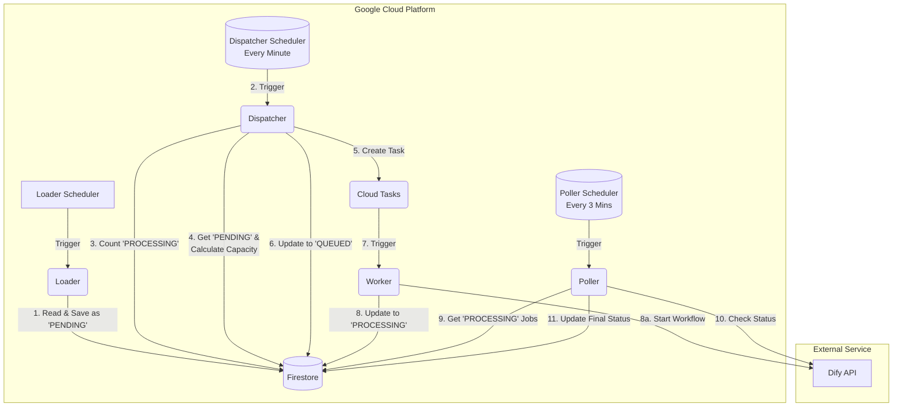

# Dify Workflow Batch Processor System

## 1. 개요

이 시스템은 Google Sheets에 저장된 데이터를 읽어 Dify LLM 워크플로우를 병렬로 실행하고, 그 결과를 안정적으로 처리하기 위해 설계되었습니다. **Dispatcher와 Polling 아키텍처**를 채택하여, Dify API 서버의 부하를 정밀하게 제어하면서 장시간 소요되는 작업을 안정적으로 처리합니다.

시스템은 **`loader`**, **`dispatcher`**, **`worker`**, **`poller`** 네 개의 핵심 서비스로 구성되며, **Cloud Run**, Cloud Tasks, **Firestore (Datastore Mode)**, Cloud Scheduler를 사용하여 효율적이고 안정적인 데이터 처리를 보장합니다.

## 2. 아키텍처

### 2.1. 시스템 아키텍처 다이어그램



### 2.2. 구성 요소 및 워크플로우

-   **Cloud Run (Loader)**: 주기적으로 트리거되어 Google Sheets에서 데이터를 읽고, 처리할 작업을 Firestore에 **`PENDING`** 상태로 저장합니다.
-   **Cloud Run (Dispatcher)**: 1분마다 트리거됩니다. Firestore에서 `PROCESSING` 상태인 작업 수를 확인하여 현재 시스템 부하를 파악하고, 설정된 최대 동시 실행 수(`max_concurrent_workflows`)에 맞춰 처리 가능한 만큼의 `PENDING` 작업에 대한 Cloud Tasks를 생성합니다. 태스크가 생성된 작업은 **`QUEUED`** 상태로 변경됩니다.
-   **Cloud Tasks**: `Dispatcher`로부터 받은 태스크를 큐에 저장하고, `Worker`에게 안전하게 전달합니다.
-   **Cloud Run (Worker)**: Cloud Tasks로부터 태스크를 받아 Dify API를 비동기 스트리밍 모드로 호출하여 워크플로우 실행을 시작합니다. Dify로부터 받은 `workflow_run_id`를 Firestore에 저장하고 상태를 **`PROCESSING`**으로 변경한 후 즉시 종료됩니다.
-   **Cloud Run (Poller)**: 3분마다 트리거됩니다. Firestore에서 `PROCESSING` 상태인 작업을 조회하고, `workflow_run_id`를 사용하여 Dify API에 작업 진행 상태를 문의(Polling)합니다. 작업이 완료(`succeeded` 또는 `failed`)되었으면 최종 결과를 Firestore에 업데이트합니다.
-   **Firestore (Datastore Mode)**: 각 데이터의 처리 상태(`PENDING`, `QUEUED`, `PROCESSING`, `SUCCESS`, `FAILED`)와 `workflow_run_id` 등 모든 관련 데이터를 저장하고 관리합니다.

## 3. 설정 및 배포 (Terraform)

### 3.1. 사전 준비 사항

1.  **Terraform 설치**: Terraform CLI를 설치합니다.
2.  **GCP 인증**: `gcloud auth application-default login` 명령어를 실행하여 Terraform이 GCP에 접근할 수 있도록 인증합니다.
3.  **소스 코드 버킷 생성**: Cloud Function(2nd gen) 소스 코드를 업로드할 Google Cloud Storage 버킷이 Terraform에 의해 자동으로 생성됩니다.
4.  **Google Sheets API 활성화**: GCP 프로젝트에서 Google Sheets API를 활성화합니다.
5.  **서비스 계정 생성 및 키 저장**:
    -   Google Sheets에 접근할 수 있는 권한(`roles/sheets.reader`)을 가진 서비스 계정을 생성하고, 키(JSON)를 다운로드합니다.
    -   **Google Sheets API 인증 정보 생성 및 등록**:
        1.  `gcloud` CLI를 사용하여 `dify-batch-processor-credentials`라는 이름으로 시크릿을 생성합니다.
            ```bash
            gcloud secrets create dify-batch-processor-credentials --replication-policy="automatic"
            ```
        2.  다운로드한 서비스 계정 키 파일(`.gcp/solvook-infra-2b84d4594582.json`)을 사용하여 시크릿 버전을 추가합니다.
            ```bash
            gcloud secrets versions add dify-batch-processor-credentials --data-file="./.gcp/solvook-infra-2b84d4594582.json"
            ```

    -   **Dify API Key 생성 및 등록**:
        1.  `gcloud` CLI를 사용하여 시크릿을 생성합니다.
            ```bash
            gcloud secrets create dify-api-key --replication-policy="automatic"
            ```
        2.  Dify API 키 값을 시크릿 버전으로 추가합니다. `YOUR_DIFY_API_KEY` 부분을 실제 키 값으로 변경하세요.
            ```bash
            printf "YOUR_DIFY_API_KEY" | gcloud secrets versions add dify-api-key --data-file=-
            ```
6.  **Firestore 설정**: GCP 프로젝트에서 **Datastore 모드**로 Firestore 데이터베이스를 활성화합니다.

### 3.2. Terraform 변수 설정

`terraform/environments/dev/terraform.tfvars` 파일에 아래 변수들을 추가하거나 수정합니다.

```hcl
# Dify Data Processor Variables
spreadsheet_id                      = "YOUR_GOOGLE_SHEET_ID"
sheet_name                          = "Sheet1"
unique_id_column                    = "0" # 또는 "ROW_NUMBER"
dify_api_endpoint                   = "https://your-dify-api.example.com/v1/workflows/run"
dify_api_key_secret_id              = "dify-api-key"
dify_api_timeout_minutes            = 10
google_sheets_credentials_secret_id = "dify-batch-processor-credentials"
passage_analysis_workflow_id        = "workflow-id-for-analysis"
passage_workbook_workflow_id        = "workflow-id-for-workbook"
max_concurrent_workflows            = 2 # Dify에서 동시에 실행할 최대 워크플로우 수
```

### 3.3. 병렬 실행 설정 (Concurrency)

Dify API 서버의 부하를 제어하는 핵심 설정은 `max_concurrent_workflows` 변수입니다. `Dispatcher`는 이 값을 기준으로 Firestore의 `PROCESSING` 작업 수를 확인하여 새로운 작업을 얼마나 시작할지 결정합니다.

Cloud Tasks의 `rate_limits`는 `Dispatcher`가 `Worker`를 호출하는 속도를 제어하는 보조적인 역할을 합니다.

### 3.4. Terraform 배포

1.  `dev` 환경 디렉터리로 이동합니다.
    ```bash
    cd terraform/environments/dev
    ```
2.  Terraform을 초기화합니다.
    ```bash
    terraform init
    ```
3.  Terraform 실행 계획을 확인합니다.
    ```bash
    terraform plan
    ```
4.  계획에 문제가 없으면 리소스를 배포합니다.
    ```bash
    terraform apply
    ```

배포가 완료되면 `dify-batch-processor-loader` 서비스의 URL이 출력됩니다. 이 URL을 사용하여 Cloud Scheduler를 설정하거나 직접 호출하여 데이터 처리를 시작할 수 있습니다.

### 3.5. 모니터링

Terraform 배포 시 생성되는 커스텀 대시보드에서 `loader`, `dispatcher`, `worker`, `poller` 네 서비스의 주요 지표를 실시간으로 확인할 수 있습니다.

## 4. 로컬 개발 및 테스트 (Makefile 사용)

`loader`, `dispatcher`, `worker`, `poller` 함수를 로컬 환경에서 테스트할 수 있습니다. 로컬 테스트는 실제 GCP 서비스 대신 Firestore 에뮬레이터를 사용합니다.

### 4.1. 사전 준비 사항

1.  **Python & Poetry**: 프로젝트 의존성 관리를 위해 필요합니다.
2.  **GCP 서비스 계정 키**: `loader`가 Google Sheets에 접근하기 위해 필요합니다. (`.gcp/` 디렉터리에 JSON 키 파일 저장)

### 4.2. 테스트 설정

1.  **(최초 1회)** `dify-batch-processor` 디렉터리에서 아래 명령어를 실행하여 Python 의존성을 설치합니다.
    ```bash
    make install
    ```

2.  **(최초 1회)** 환경 변수 설정 파일을 생성합니다.
    ```bash
    make setup
    ```
    이 명령어는 `.env.example` 파일을 복사하여 `.env` 파일을 생성합니다. 생성된 `.env` 파일을 열어 `YOUR_...`로 표시된 값들을 실제 프로젝트에 맞게 수정해야 합니다.

### 4.3. 로컬 코드와 실제 GCP 리소스 연동 테스트 (하이브리드)

로컬에서 코드를 수정하면서 Firestore 에뮬레이터가 아닌, **실제로 GCP에 배포된 Datastore와 Cloud Tasks 리소스와 연동**하여 테스트할 수 있습니다. 이 방식은 보다 현실적인 환경에서 각 서비스의 상호작용을 검증할 때 유용합니다.

#### 4.3.1. 사전 준비 사항

1.  **Terraform 배포 완료**: 테스트하려는 환경(예: `dev`)의 GCP 리소스가 `terraform apply`를 통해 배포되어 있어야 합니다.
2.  **GCP 인증**: 로컬 환경에서 GCP 서비스에 접근할 수 있도록 `gcloud` CLI를 통해 인증해야 합니다.
    ```bash
    gcloud auth application-default login
    ```

#### 4.3.2. `.env` 파일 설정

`make setup`으로 생성된 `.env` 파일이 실제 GCP 리소스를 바라보도록 수정해야 합니다. **가장 중요한 것은 `FIRESTORE_EMULATOR_HOST` 변수를 주석 처리하거나 삭제하는 것입니다.**

```dotenv
# .env

# --- General Settings ---
# FIRESTORE_EMULATOR_HOST="localhost:8080" # << 이 줄을 반드시 주석 처리하거나 삭제하세요.
GCP_PROJECT_ID="your-gcp-project-id"       # << 실제 GCP 프로젝트 ID로 설정
GCP_LOCATION="asia-northeast3"             # << 리소스가 배포된 리전으로 설정

# --- Service Specific Settings ---
# loader, dispatcher, worker, poller가 사용하는 환경 변수들을
# terraform/environments/dev/terraform.tfvars 파일과 일치하도록 설정합니다.
# 특히 아래 값들은 실제 배포된 리소스의 정보를 정확히 입력해야 합니다.

# (예시) dispatcher가 Cloud Tasks 큐를 찾기 위해 필요
QUEUE_NAME="dify-batch-processor-queue" # Terraform으로 생성된 Cloud Tasks 큐 이름

# (예시) dispatcher가 worker를 호출하기 위해 필요
WORKER_URL="https://dify-batch-processor-worker-....run.app" # 배포된 worker의 Cloud Run URL

# 기타 필요한 모든 변수 (SPREADSHEET_ID, DIFY_API_ENDPOINT 등)
# ...
```

#### 4.3.3. 하이브리드 테스트 워크플로우

1.  **터미널 1: Worker 실행**
    로컬에서 `worker`를 실행하여 실제 Cloud Tasks 큐로부터 작업을 받을 준비를 합니다.
    ```bash
    make run-worker
    ```

2.  **터미널 2: Loader 실행**
    로컬에서 `loader`를 실행합니다. `loader`는 Google Sheets에서 데이터를 읽어 **실제 GCP Datastore**에 `PENDING` 상태로 작업을 저장합니다.
    ```bash
    make run-loader
    ```
    GCP 콘솔의 Datastore에서 데이터가 `PENDING` 상태로 추가되었는지 확인합니다.

3.  **터미널 3: Dispatcher 실행**
    로컬에서 `dispatcher`를 실행합니다. `dispatcher`는 **실제 GCP Datastore**에서 `PENDING` 상태의 작업을 조회하고, 용량이 확보되었다면 **실제 Cloud Tasks 큐**에 태스크를 생성합니다.
    ```bash
    make run-dispatcher
    ```

4.  **결과 확인**:
    -   `dispatcher` 실행 후, **터미널 1 (`worker`)** 로그에 Cloud Tasks로부터 태스크를 수신하여 처리를 시작하는 내용이 출력되는지 확인합니다.
    -   GCP 콘솔의 Datastore에서 작업 상태가 `PENDING` -> `QUEUED` -> `PROCESSING`으로 변경되는 것을 확인합니다.

5.  **터미널 4: Poller 실행 (선택 사항)**
    `PROCESSING` 상태의 작업을 확인하고 싶다면, 로컬에서 `poller`를 실행하여 실제 Datastore의 데이터를 기반으로 Dify API 상태 조회를 수행할 수 있습니다.
    ```bash
    make run-poller
    ```

#### 4.3.4. 중요: VPC 서비스 제어(VPC-SC) 환경에서의 제약

> ⚠️ **경고**: 이 하이브리드 테스트 방식은 GCP 조직에 **VPC 서비스 제어(VPC Service Controls)**가 활성화된 경우, `CONSUMER_INVALID` 에러를 발생시키며 실패할 가능성이 매우 높습니다.

-   **원인**: VPC-SC는 신뢰할 수 없는 네트워크(예: 개발자의 로컬 머신)에서 GCP 서비스 API로의 직접적인 호출을 보안 정책상 차단합니다.
-   **해결 방안**: 이 문제를 해결하려면 보안 경계 **내부**에서 코드를 실행해야 합니다. GCP 프로젝트 내에 작은 GCE(Google Compute Engine) VM 인스턴스를 생성하고, 해당 VM에 접속하여 이 가이드의 `4.4.3` 단계를 수행하면 됩니다. 모든 API 호출이 GCP 내부 네트워크에서 발생하므로 VPC-SC 정책에 의해 차단되지 않습니다.

### 4.4. 배포된 서비스 테스트 (End-to-End)

GCP에 배포된 전체 파이프라인을 즉시 실행하여 테스트할 수 있습니다. 아래 명령어는 `loader`를 트리거하는 Cloud Scheduler 작업을 즉시 실행시킵니다.

```bash
make test-deployed
```

명령 실행 후 GCP 콘솔의 Cloud Logging에서 `dify-batch-processor-loader`, `dify-batch-processor-worker`, `dify-batch-processor-poller` 서비스의 로그를 순차적으로 확인하여 전체 파이프라인이 정상적으로 동작하는지 확인할 수 있습니다.
